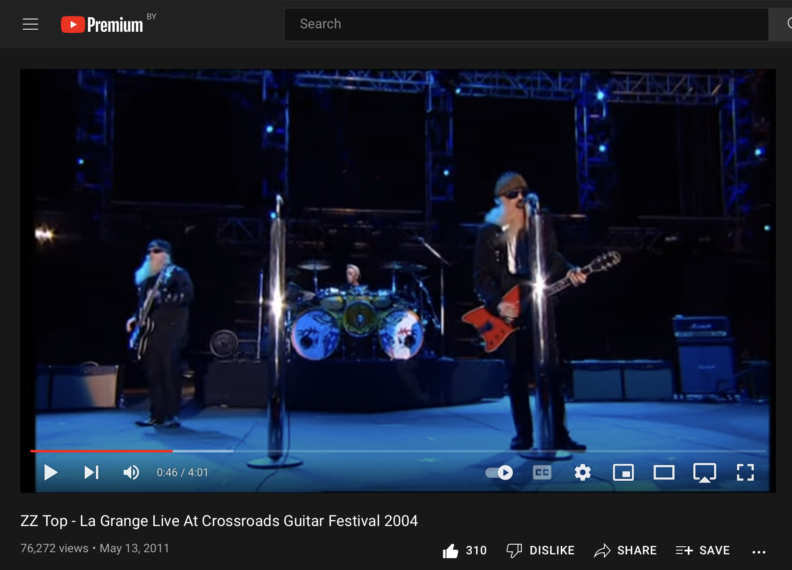
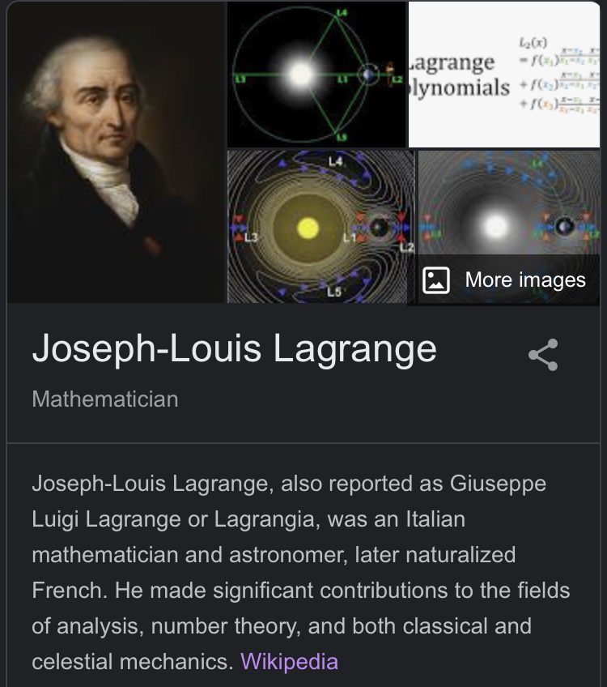
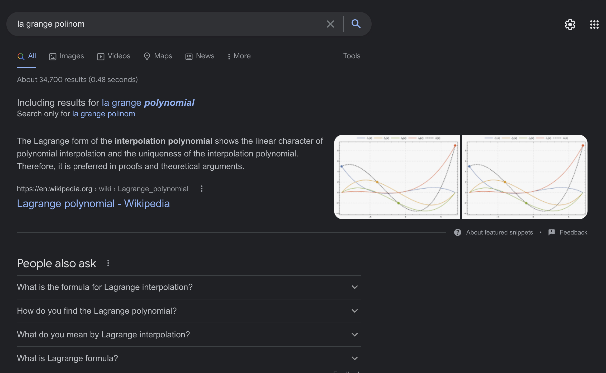

# Как я запускал мистификацию
На одном из проектов стояла задача прогноза поведения некого графика исходя из его исторических значений. Сама постановка задачи была основана на допущении, что так как весь предыдущий график обусловлен некоей закономерностью, то, узнав эту закономерность, мы сможем спрогнозировать его дальнейшее поведение.

Это классический случай в математике, когда функция задается эмпирически (набором точек), а не аналитически (формулой). Задача, по сути, состоит в том, чтобы подобрать такую формулу, график которой совпадает с изначальным графиком во всех известных заданных точках, а дальше, подставляя в эту формулу значения, неизвестные заранее, предсказать выходные значения. Это называется интерполяцией и изучается на 1-2 курсе университета любой математической, физической или технической направленности. Как выяснилось позже, оно действительно изучается, но вот студентам не всегда объясняют, когда и куда ее можно применить в дальнейшей работе.

Чтобы не грузить вас деталями, скажу просто: у меня в голове сразу возникло примерное понимание решения: выводить интерполяционный полином Лагранжа и подставлять в него нужные значения для прогноза.

Я решил не предлагать готовое решение своей команде, а сыграть с ними в игру: 

>Объявляю охоту на лучший алгоритм для расчета форекаста.
>Кому интересно,
>1) Описывайте ваш алгоритм в комментариях в этом >треде.
>2) Кто первый опишет что-то, сильно похожее на то, что думаю я, получит премию
>3) Кто предложит что-то лучше, чем то, что думаю я, получит большую премию
>4) Срок принятия заявок - до конца следующей недели
>5) Завтра вечером в этом треде опубликую свою подсказку - возможно, она поможет выбрать перспективное направление
>6) Подробность описания алгоритма - достаточный для того, чтобы любой программист его понял и мог заимплементить. Если требуются ссылки на определения, формулы, уравнения, вставляйте в текст описания алгоритма.
 
>Лучший алгоритм будет выбираться по характеристикам в следующем порядке:
>1) универсальность
>2) простота реализации
>3) расчетная точность предсказания
>4) асимптотическая сложность 
 
>Через понедельник подведем итоги и я поделюсь своей версией.
>П.С. Предвижу остряков, уточняющих размеры премий. Отвечаю сразу: шоу ме зе резалт, энд айл шоу ю зе мани.

Первой подсказкой было вот такое сообщение:

>Подсказка: https://youtu.be/WAN4gYSw0yE

Это была ссылка на выступление группы ZZ Top с песней La Grange. Если ты немного "в теме", то сразу догадаешься, о чем идет речь. Если ты не в теме, то можешь попробовать запросы вроде 

La Grange Chart - находит ноты песни La Grange
La Grange Points - находит что-то на тему астрофизики
La Grange Forecast - находит прогноз погоды в техасском городке
La Grange Function -  находит метод Лагранжа для нахождения локальных экстремумов. Тоже математика, но не та, которая нам нужна

Каждый из этих четырех запросов потенциально способен затянуть ищущего в кроличью нору. Например, первый наведет тебя на мысль, что ответ зашифрован в нотах песни, и что тебе нужно проявить навыки криптографии и выудить-таки оттуда ответ. Второй - что надо погрузиться в астрофизику и связать ее с астрологией, ведь астрология занимается прогнозами, а мы как раз хотим прогнозировать поведение функции. Третий решит посмотреть достопримечательности городка, нарисовать на карте линии, их соединяющие, и получить фигуру, которая даст ответ на мою загадку, особенно если совместить ее с координатами городка и прогнозом температуры и влажности: цифры дадут ответ! Четвертый пойдет через математический анализ, посчитав, что локальные минимумы и максимумы значений являются определяющими для прогноза поведения функции. Каждый из путей сулит бессонные ночи, полные построений теорий, оценке их правдоподобности,собирания обнаруженных фактов и выявления закономерностей, внезапных прозрений ("Так вот что этот хитрец (я) имел в виду!") и разочарований, ведущих... никуда.

Мне было очень интересно, кто сможет праильно интерпретировать первую подсказку. Ведь большинство людей из команды проходили интерполяцию в университете. Ведь просто вспомнив фамилию великого математика и введя в гугл его имя без пробела, можно было наткнуться на несколько картинок в превьюшке статьи о нем. На одной из картинок упоминается полином Лагранжа - как раз то, что мы и ищем.

Никто не догадался этого сделать. Зато весьма популярной стала теория о том, что скрытый смысл зашит в тексте песни. Одной из вариаций оказалось то, что так как в песне упоминается бордель, то это намек на беспорядочность явления, а значит, в вычислении прогноза должен каким-то образом участвовать рандомизатор. Люди очень серьезно занялись разработкой этой версии, проводили бессонные ночи, напрягали мозги до скрипа и ... были абсолютно счастливы. Редко бывает в жизни возможность испытать настоящий азарт исследователя, который точно значет, что ответ точно есть, хоть и путь к нему неясен, и каждая новая теория вызывает бурю эмоций, ведь именно эта теория потенциально даст ответ!

Еще одним интересным моментом стало то, что ребята обращались к родственникам - профессиональным математикам, пересказывая задачу своими словами и добавляя к изложению задачи свои домыслы. Столкнувшись с такой постановкой задачи, профессиональные математики включались в эту игру и с удовольствием подкидывали еще более умные и сложные построения.

Прошло две недели, и я дал вторую подсказку:

Здесь также можно было зацепиться за многое:

Во-первых, там был конкретный адрес в городе Улан-Удэ, а это, между прочим, координаты, на основе цифр которых можно наконец найти нужный ответ. Ну или на худой конец прочертить на карте прямую линию от городка в Техасе до Улан-Удэ и посмотреть названия всех населенных пунктов, которые оказались на этой линии. Или прочертить перпендикуляры от близлежащих городков к этой линии и словить инсайт о том, что это похоже на линейный тренд на графике и что это намек на то, что нужно каким-то образом улучшить формулу вычисления линейного тренда по стравнению с той, что существует уже сейчас.

Во-вторых, можно было зацепиться за название профессии "Комплектовщик-кладовщик". "Кладовщик" намекает нам на то, что нужно опираться на историю, на предыдущие значения функции, и это было в изначальных условиях моего задания, так что тут все сходится. "Комплектовщик" означает, что надо правильно достать из исторических данных нужные факты и скомплектовать их, и ответ не заставит себя долго ждать.

В-третьих, зарплата в 32000 рублей очень сильно намекает на двоичный код, ведь число 32 - это степень двойки.

В-четвертых, в разделе "Требования" наверняка перечислены качества, которые нужно в себе развить, чтобы разгадать мою загадку:
> Опты работы / Знание 1С / Ответственность, внимательность, Дисциплинированность / умение чи... (дальше закрыто плашкой с диалогом) документы / физически сильные
Ведь неслучайно допущена опечатка в слове "Опыт"? На что это намекает? На то, что ключ к разгадке лежит в коллективной работе, так сказать, оптом? Или опты - это opts, operators? А загадочное умение Чи? Не связано ли это с владением энергией Чи, более известной как энергия Ци? Кстати, если написать Ци так, как оно произносится, получится "Цы", что относит нас к цыганам, кочевому народу. Возможно, стоит поискать разгадку в цыганской культуре? Ведь у них очень распространены песни под гитару, что очень хорошо согласуется с первой подсказкой!

Вы думаете, я это все сочинил?
К тому моменту я решил расширить эксперимент за пределы своей команды и разослал задачку некоторым своим друзьям и знакомым. И я до сих пор не знаю, комментировали они подсказки всерьез или угорали. Я уже ни в чем не уверен.

Понятное дело, что я-то имел в виду адрес, по которому надо было написать: info@polinom03.ru ...По этому адресу можно довольно легко найти сайт, с которого был сделан скриншот, и обнаружить, что это сайт магазина под названием Полином.

Я рассчитывал, что люди просто введут в гугле название песни и название магазина, пусть и с ошибкой, как а электронном адресе: "La Grange Polinom". Первой же ссылкой они получат нужный ответ. 

Что ж, этого не произошло. Самым популярным мнением в команде оказалось следующее: я троллю высокооплачиваемых специалистов-айтишников, предлагая им воспользоваться предложением магазина "Полином" и отправить туда своё резюме, так как они до сих пор не предложили мне работающий алгоритм. Надо сказать, что догадка вполне логичная, потому что шуточка была вполне в моём тогдашнем стиле.

Но время шло, и я опубликовал еще одну подсказку:

> Третья подсказка https://www.interpol.int/News-and-Events/News/2021/INTERPOL-report-identifies-top-cyberthreats-in-Africa

Ну тут-то целая статья! Столько пищи для воспаленного мозга!

Во-первых, можно продолжать разрабатывать географическую теорию, ведь статья о кибербезопасности в Африке. Больше линиий, больше пунктов, больше знаков.

Во-вторых, статью можно интерпретировать как "Целевой алгоритм должен быть невзламываем, предельно безопасным"

В-третьих, в статье упоминаются ботнеты, что может означать, что аглоритм нужно распараллеливать так, чтобы он вычислялся кластером машин.

...

В-тысячетретьих, это сайт ИНТЕРПОЛА. Что же будет, если ввести "la grange interpol" в гугле? Я думаю, вы понимаете, что опять же найдете интерполяционный полином Лагранжа.

Никто из команды его не нашел. Зато строились теории, горели глаза, бушевали жаркие споры, звучали просьбы о дополнительных знаках и подсказках.

Все подсказки, которые я давал, я находил за 2-3 минуты, подсказки были максимально на поверхности (а иначе всилу мистификационной мощи человеческого интеллекта вероятность правильного использования подсказки уменьшается на порядок с каждым новым уровнем запрятывания). Этого фактора не было в головах моих коллег. Многие реально думверили, что я ради этих подсказок перерывал половину интернета и строил сложную нумерологию с шифрами и символами.

Самое интересное в этом то, что подобного рода неуспех не был обусловлен глупостью. Он был обусловлен неправильным выбором фокуса, а также получением знаний ради знаний тогда, давно, еще в университете. Повторюсь: про интерполяционный полином Лагранжа знают все, кто участвовал в этой игре. Но есть еще какая-то вещь, которой не хватило, некая способность не только накапливать знания, но и вспоминать их в правильный момент, когда именно они необходимы. И что-то мне подсказывает, что развитие этой способности зависело именно от преподавателя. Мой преподаватель по тому предмету вместе с каждой темой рассказывал и байку о том, как он с коллегами использовал эти подходы для решения научных, исследовательских и практических задач. Что ж, видимо, учиться у такого преподавателя было редчайшей удачей.

//Серендипность;

# Так было это хуйней или нет?

## Мистификация - это плохо?

Мистификации - это не плохо. Так мы познаем реальность. Но ум, который слишком увлечен задачей, переоценивает ее, зашоривается в своей теории, начинает натягивать все наблюдаемое на нее, плодит сущности и все больше утопает в своей нерабочей модели. Завлекает в свою веру все новых людей, выстраивает иерархию, сосредотачивает ресурсы, занимается лоббизмом и так далее. В процессе человек уже забывает, какую именно задачу он решал изначально. Да разве это интересно? Гораздо интереснее разрабатывать и продвигать свою теорию!

 Здесь скажу небольшую банальность, которую вы видели много раз: на теории уже построено множество карьер, адептам хочется развить свои карьеры дальше и заработать больше. Поэтому теория начинает стараться объять все большее ментальное пространство, велючая то, для которого изначально не предназначалась. Начинаются нестыковки с наблюдаемыми феноменами. По иронии судьбы сама возможность заметить эти нестыковки обеспечена этой самой теорией, давшей язык, на котором удобнее описывать оттенки и нюансы наблюдаемых явлений, которые изучает эта теория. И вот в этих оттенках и нюансах нестыковки-то и возникают. Дальше есть два принципиальных варианта: затратный и опасный против сначала дешевого и безопасного. Затратный и опасный - это продолжать уточнять теорию, устранять внутренние противоречия, а если надо, пересмотреть изначальные постулаты и пересобрать теорию заново. Затратность подхода очевидна. Опасность подхода в том, что авторитет построивших карьеры с каждым уточнением будет снижаться, а при пересборке теории на исправленных постулатах и вовсе быть низвергнут. Стоит добавить к этому и то, что с возрастом заниматься такими авантюрами, как пересборка крупной теории, становится невозможно физиологически. Поэтому чаще выбирается второй вариант: врать, замалчивать, отрицать, затыкать. 

 
 Но это бесполезно, потому что пытливый ум легко заметит подобную ложь и оставит теорию на свалке истории, назвав её очередной мистификацией, низвергнув и забыв о том, что мистификация эта принесла много пользы с точки зрения продвижения в понимании вопроса.

## Какова роль образования во всем этом?

Становится понятно, что доступ к информации в интернете не заменит образования, более того, при его отсутствии он следает нахождение ответов невозможным, так как необразованный человек погрязнет в нерабочих мистификациях.

Если у тебя есть хорошее образование в сфере, то оно помогает не тем, что ты помнишь все свои конспекты наизусть, а тем, что у тебя в голове имеется некая картотека с указателями на нужную информацию или хотя бы на способ или направление, в котором можно найти нужный ответ или намек на него. В подсказках же ответ чаще всего лежит на поверхности, потому что прятать его куда-то глубоко очень и очень сложно, это как придумывать фантастический мир и считать его реальностью. Это как врать, когда каждую нестыковку нужно объяснять дальнейшей ложью, держать всю ложь в памяти, объяснять, пытаться сохранить это внутренне непротиворечивым, при том, что количество нестыковок нарастает в геометрической прогрессии и вам нужно объяснять их все больше и больше. Короче, есть предел, за которым уже не хватает ресурса поддерживать ложь. Как бы много ресурсов ни было, концептуально предел есть, а значит, ты в него упрешься.

//аналогия знаний с системой управления базами данных - данные могут лежать даже у тебя на винте, но если не знаешь, как их найти через систему кешей и индексов, то не получится у тебя использовать эти данные